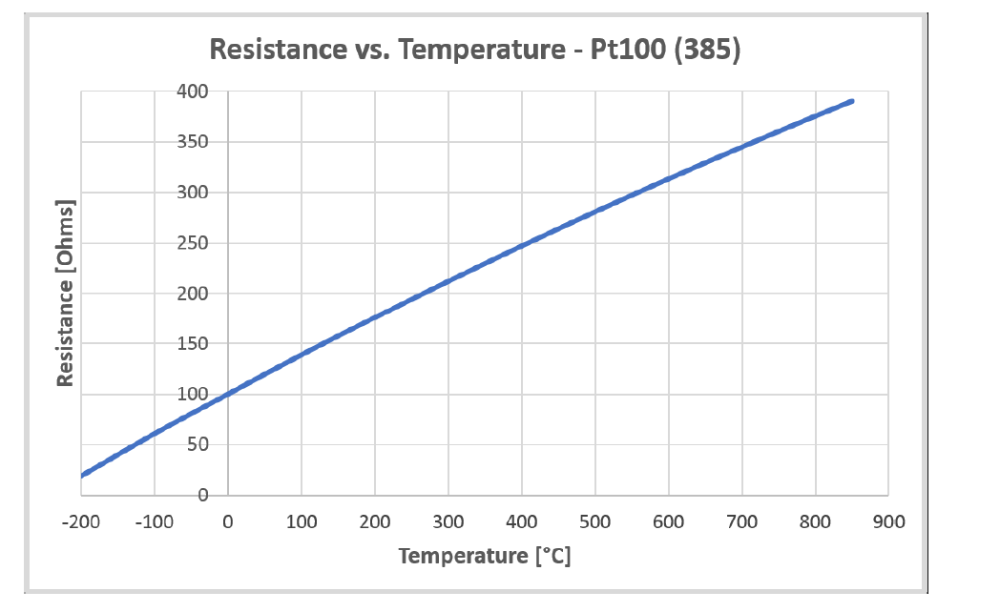
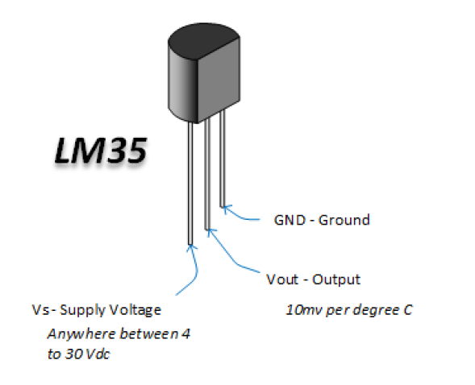

# Temperature-control-system-using-STM32F407VGT6-LM35-HC-SR05-and-Stepper-motor
 
# LM35 : 
This a Temperature Sensor that measures temperature and based on a formula we can access the environment temperature from lm35's voltage.

