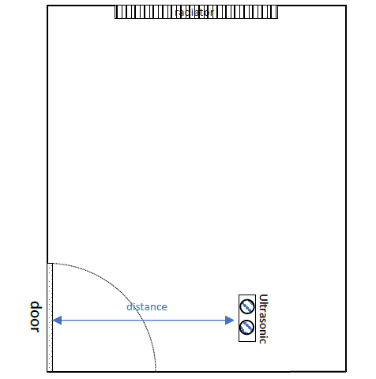
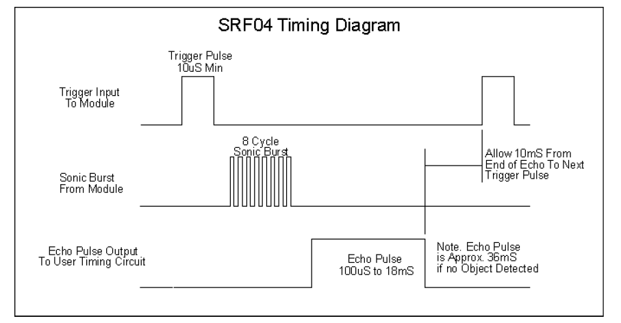
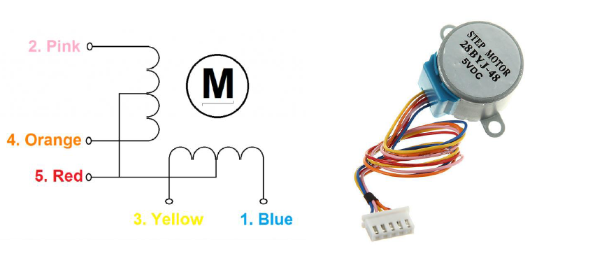
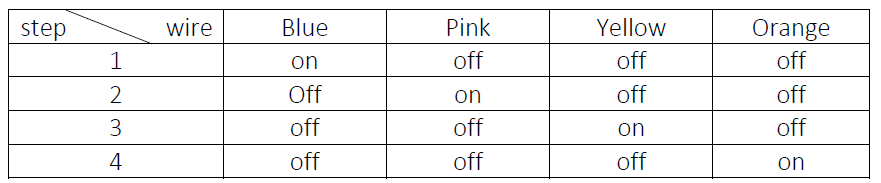

# Temperature-control-system-using-STM32F407VGT6-LM35-HC-SR05-and-Stepper-motor
 In this project first, we constantly measure the temperature and distance and if the temperature and if the temperature is high the motor will rotate and will close the valve and vice versa additionally if the distance is lower than some value the Stepper motor will work based on the setpoint but if the distance is greater than that value the stepper motor will open the valve completely 
user can send and receive commands that are contained with the Temperature value and the stepper motor condition ( automate or manual ) if the user set the stepper motor on manual he can change the setpoint and regulate the temperature manual but otherwise, it is automate 
# LM35 : 
This is a Temperature Sensor that measures temperature and based on a formula we can access the environment temperature from lm35's voltage.

# HC-SR05 (Ultrasonic) : 
This a distance measurement sensor and for this project, I used the rising edge method to calculate the distance after every clock 

# Stepper Motor : 
I used this motor as a valve controller (if the Temperature is high the motor will rotate and will close the valve and vice versa ), The method I used for Stepper Motor is half step that is based on the below table.

# Arduino Due :
I used this for sending and receiving commands.
